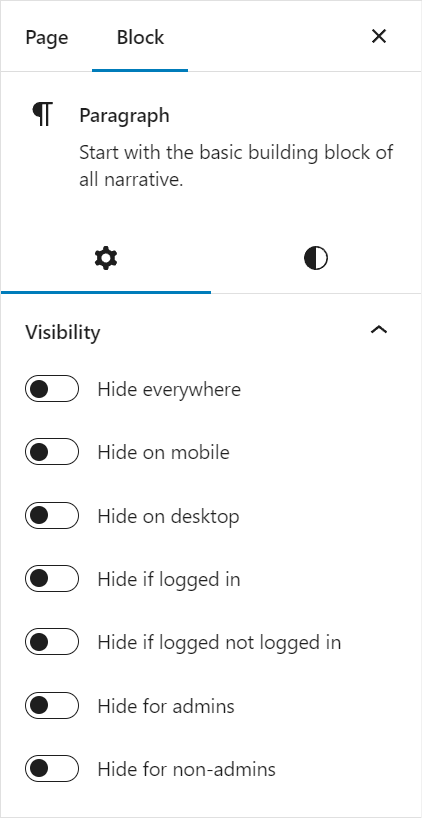
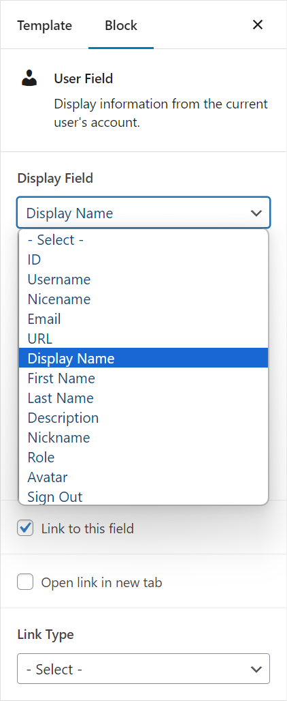

# RS Utility Blocks (WordPress Plugin)

_Adds custom blocks and utilities to the block editor, including visibility conditions and blocks to display the current user's information._

```
Contributors: radgh
Requires at least: 6.0
Tested up to: 6.4.3
Requires PHP: 5.7
License: GPLv3
License URI: http://www.gnu.org/licenses/gpl-3.0.txt
```

## Description

This plugin adds several blocks and utilities to the block editor, including visibility conditions and blocks to display the current user's information.

### Block Settings

- **Visibility** - Allows you to control the visibility of a block based on if the user is logged in, on a desktop or mobile, or if the user is an administrator. Available to most blocks.



### Custom Blocks

- **Post Field** - Allows you to display fields for a post including: Post title, content, excerpt, date, author, and more.

- **User Field** - Allows you to display a field from a user's profile, including their name, email, logout url, and other fields.



## Development Setup

To use Javascript to compile the file in /assets/scripts/src/block-editor.js you must first install NPM, then follow these steps:

**Automatic:** Install dependencies from package.json:

  ```npm install```

**Expanded:** Install dependencies by script names:

  ```npm install @wordpress/scripts @wordpress/block-editor @wordpress/blocks @wordpress/components @wordpress/compose @wordpress/dom-ready @wordpress/edit-post @wordpress/element @wordpress/hooks @wordpress/icons @wordpress/plugins @wordpress/rich-text --save-dev```

### Compile scripts:

> npm run build

### Watch scripts:

> npm run start

## Changelog

### 1.0.0
* Initial release