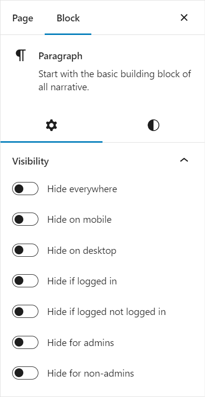
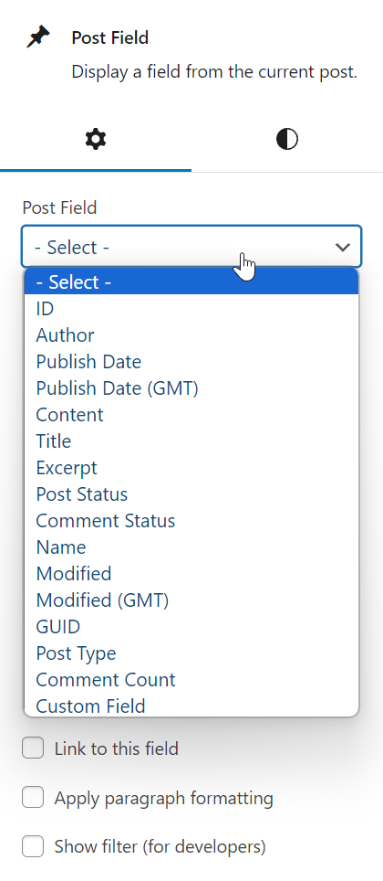
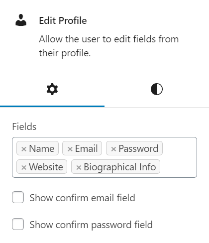
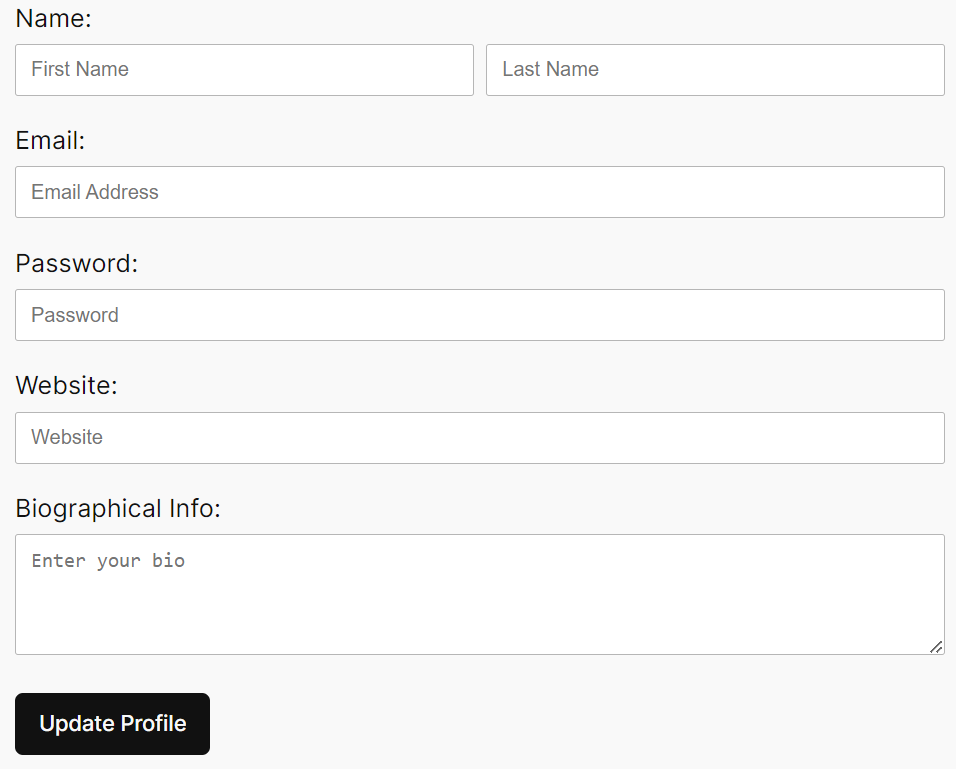
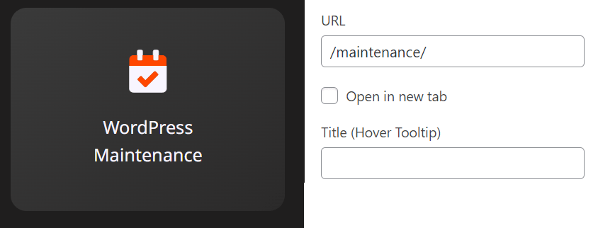
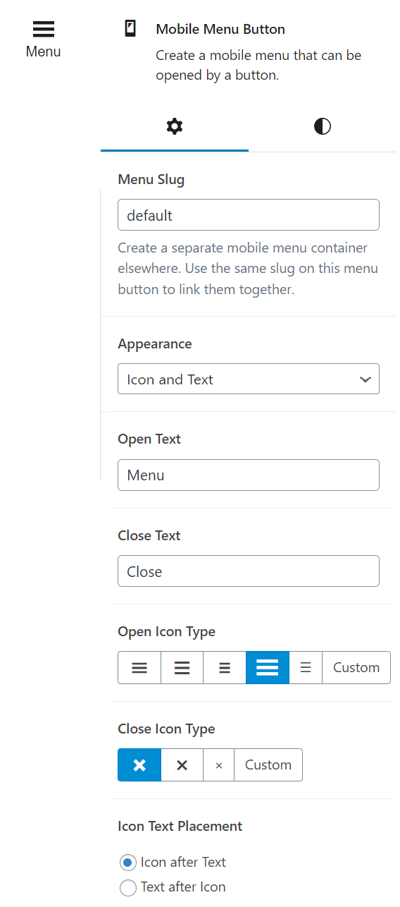
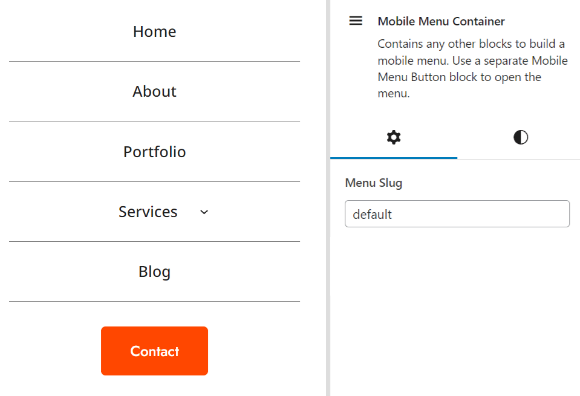

# RS Utility Blocks (WordPress Plugin)

_Adds custom blocks and utilities to the block editor, including visibility conditions and blocks to display the current user's information._

```
Contributors: radgh
Requires at least: 6.0
Tested up to: 6.5.2
Requires PHP: 8.0
License: GPLv3
License URI: http://www.gnu.org/licenses/gpl-3.0.txt
```

## Description

This plugin adds several blocks and utilities to the block editor, including visibility conditions and blocks to display the current user's information.

### Block Settings

- **Visibility** - Allows you to control the visibility of a block based on if the user is logged in, on a desktop or mobile, or if the user is an administrator. Available to most blocks.



### Custom Blocks

- **Post Field** - Allows you to display fields for a post including: Post title, content, excerpt, date, author, and more.



- **User Field** - Allows you to display a field from a user's profile, including their name, email, logout url, and other fields.


- **Edit Profile** - Display a form to allow users to edit their name, email, password, website, and bio.



Here is the edit profile form, as it appears on the front-end:



- **Link Block** - Allows you to create a link with custom text and URL, containing any blocks of your choice.



- **Mobile Menu Button** - Displays a button that toggles the visibility of a container block when clicked.



- **Mobile Menu Container** - Displays a container block that is hidden by default and shown when the mobile menu button is clicked.



## Plugin Updates

This plugin is hosted on GitHub. To enable automatic plugin updates you can use the plugin [Git Updater](https://github.com/afragen/git-updater).

## Development Setup

To use Javascript to compile the file in /assets/scripts/src/block-editor.js you must first install NPM, then follow these steps:

**Automatic:** Install dependencies from package.json:

  ```npm install```

**Expanded:** Install dependencies by script names:

  ```npm install @wordpress/scripts @wordpress/block-editor @wordpress/blocks @wordpress/components @wordpress/compose @wordpress/dom-ready @wordpress/edit-post @wordpress/element @wordpress/hooks @wordpress/icons @wordpress/plugins @wordpress/rich-text --save-dev```

### Compile scripts:

> npm run build

### Watch scripts:

> npm run start

## Developer Actions and Filters

### 1. Login form args

In this example, we can disable the "Remember Me" checkbox within the Login Form block. Place this code in your theme's functions.php. To see available args, refer to [wp_login_form()](https://developer.wordpress.org/reference/functions/wp_login_form/).

```php
function my_theme_login_form_args( $args, $action = 'login' ) {
    // Disable the "Remember Me" checkbox
    $args['remember'] = false;
    
    return $args;
}
add_filter( 'rs/login_form/args', 'my_theme_login_form_args', 10, 2 );
```

### 2. User field value fallback

In this example, a user field displays the user's first name. If it is blank, it falls back to the username instead.

Default: (empty)

Formatted: radgh

```php
function my_theme_user_first_name_fallback( $value, $user_id, $display_field, $custom_field_key ) {
    if ( $display_field === 'first_name' && empty( $value ) ) {
        $user = get_user_by( 'ID', $user_id );
        if ( $user && $user->ID > 0 ) {
            $value = $user->get('first_name') ?: $user->get('user_login');
        }
    }
    
    return $value;
}
add_filter( 'rs/user_field', 'my_theme_user_first_name_fallback', 10, 4 );
```

### 3. Post field with formatted date

In this example, a post field displays the post's date as a relative date along with a formatted date.

Default: 2024-04-07 11:05:47

Formatted: "Posted 1 week ago at 11:05 am"

```php
function my_theme_post_field_date_formatting( $value, $post_id, $display_field, $custom_field_key, $block ) {
	if ( $display_field === 'post_date' && empty( $value ) ) {
		$timestamp = get_post_time( 'U', false, $post_id );
		if ( $timestamp ) {
			$diff = human_time_diff( $timestamp );
			$date = get_the_time( get_option( 'time_format' ), $value );
			$value = 'Posted '. $diff .' ago at ' . $date;
		}
	}
	
	return $value;
}
add_filter( 'rs/post_field', 'my_theme_post_field_date_formatting', 10, 5 );
```

## Changelog

### 1.3.4
* Improved block editor display for the breadcrumb and post field blocks. For singular and archive templates, it should now use the correct post type based on the page template.

### 1.3.3
* Hide mobile menu on desktop if opened before screen size change
* Added Breadcrumbs block

### 1.3.2
* Fit visibility tooltips to left
* Added color support to Post Field block
* Hide mobile menu on desktop if opened before screen size change

### 1.3.1
* Upgraded post field to include date formatting, featured image, image size, author links, and post modified time
* Post field filters now support a 5th argument `$block` which contains the block settings.

### 1.3.0
* Added mobile menu button and mobile menu container blocks

### 1.2.9
* Fixed toolbar covered by visibility tooltip on backend
* Added Link Block

### 1.2.8
* Fixed visibility appearance on block editor

### 1.2.7
* Added better description to each included ACF field
* Updated readme with more example filters and better descriptions

### 1.2.6
* Added edit profile block.

### 1.2.3
* Added `GitHub Plugin URI` to enable plugin updates using Git Updater.

### 1.2.2
* Added `rs/login_form/args` filter to modify the login form args.

### 1.0.0
* Initial release